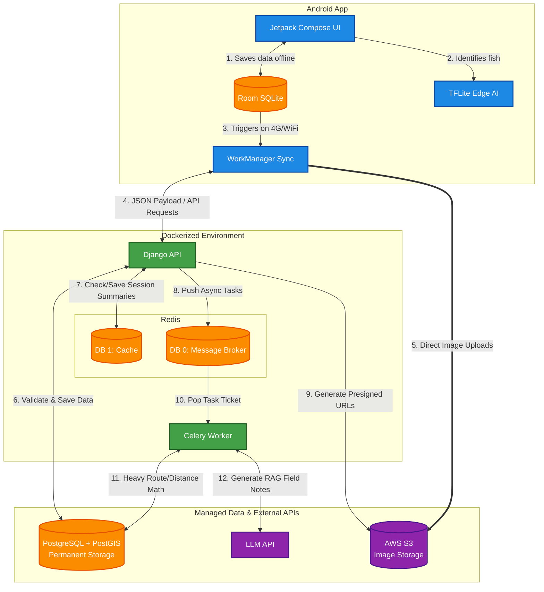
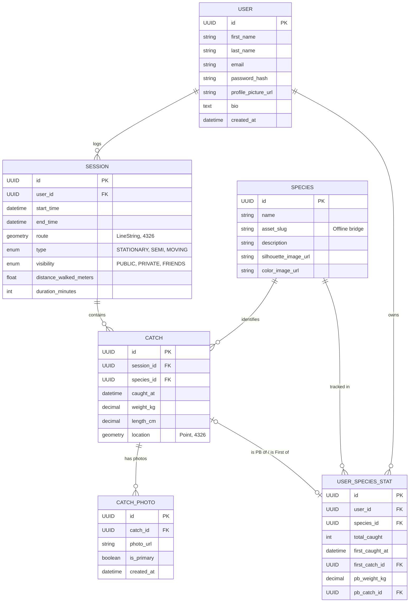

# KeepNet

A fishing catch tracking app

## Tech Stack

- **Frontend:** Native Android (Kotlin)
- **Backend:** Django REST Framework + GeoDjango
- **Database:** PostgreSQL with PostGIS extension 

## User Stories

### 1. Session Tracking & Mapping
* **As a User,** I want to select between three session tracking modes to optimize battery:
    * **Active (Lure/Fly):** Low-frequency continuous tracking.
    * **Stationary (Peg/Carp):** Single-shot GPS anchor.
    * **Roving (Stalking):** Smart waypoint tracking.
* **As a User,** I want the ability to start a fishing session based on those modes.
* **As a User,** I want the ability to log a fish catch in real-time via an in-app camera, or retroactively by uploading a gallery photo, allowing the app to automatically extract the time and GPS location from the image's EXIF metadata.
* **As a User,** I want the ability to log a session and catches completely offline, and have the app automatically sync to the cloud when I regain internet connection.
* **As a User,** I want to see a comprehensive summary of my session when it ends.
* **As a User,** I want to see a public heatmap of aggregated fishing activity to discover new waters.

### 2. Privacy & Auth
* **As a User,** I want to securely register and log into my account.
* **As a User,** I want the ability to control the privacy (Public, Friends-Only, Private) of my overall session routes.
* **As a User,** I want independent privacy controls for individual catches, allowing me to share my route but keep a specific catch location private.
* **As a User,** I want the ability to delete my account (hard-deleting private data while safely anonymizing public heatmap data).

### 3. Fish Classificaion
* **As a User,** I want my catches to be automatically classified by an on-device AI model.
* **As a User,** I want the ability to correct a catch classification if it's incorrect.

### 4. Navigation & UI Layout

* **As a User,** I want to see a live weather indicator at the top of my home screen so I can quickly check the conditions.
* **As a User,** I want a quick-access button for the "AI Helper" in the top corner so I can ask for advice without leaving the feed.
* **As a User,** I want the main home screen to display an infinite-scrolling feed of recent catches (images) from my network.
* **As a User,** I want to clearly see the total count of "Tight Lines" (likes) and "Comments" under each catch photo in the feed.
* **As a User,** I want a "+" button in the navigation bar so I can instantly start a new session from any main screen.
* **As a User,** I want a "Logbook" tab to navigate to my personal fishing history and Field Guide.
* **As a User,** I want a "Heat Map" tab to easily switch to the global interactive map.
* **As a User,** I want a "Profile" tab to manage my account, settings, and view my PBs.

### 5. Profile & Social
* **As a User,** I want my profile to display my PBs (Personal Bests) for each species of fish I've caught.
* **As a User,** I want to view a "Field Guide" index of UK species, showing which ones I have caught and which are still locked.
* **As a User,** I want the ability to see other's PBs and compare them to mine.
* **As a User,** I want the ability to manage my profile details.
* **As a User,** I want the ability to manage my friendships.
* **As a User,** I want to tap a "Tight Lines" button to react to a friend's logged catch or new PB.
* **As a User,** I want to be able to leave text comments on a friend's completed session summary.

### 6. Field Notes (RAG AI Advisor)
* **As a User,** I want to receive hyper-local fishing tips generated by AI based on my real-time location, local weather, and nearby community catches.

### 7. Settings

* **As a User,**  I want the ability to customize my unit preferences in settings (e.g., toggling between Metric and Imperial for fish weight and distance).

## System Archtechture

## Database ERD Diagram

